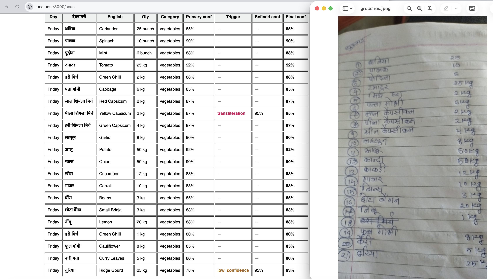

# react-native-grocery-scanner

A React Native library for scanning handwritten Devanagari grocery lists using AI vision. Supports multiple AI providers (Claude, Gemini, Groq) and outputs structured item data with optional English translations.



## Features

- Reads handwritten grocery lists in Devanagari script from photos or PDFs
- Extracts item name, quantity, unit, category, and confidence score per item
- Supports day-of-week section headers (e.g. सोमवार / Monday)
- Skips crossed-out items automatically
- Output in Devanagari, English, or both
- Configurable confidence threshold — throws on low-quality scans
- Pluggable provider interface: ship your own AI backend
- Chained provider: automatically refines low-confidence or transliterated items using a second model

## Installation

```sh
npm install react-native-grocery-scanner
```

**Peer dependencies:**

```sh
npm install react-native react-native-fs
```

Install your chosen AI provider SDK:

| Provider | Package |
|----------|---------|
| Claude (default) | `npm install @anthropic-ai/sdk` |
| Gemini | `npm install @google/generative-ai` |
| Groq | none (uses `fetch`) |

## Quick start

```ts
import { GroceryScanner } from 'react-native-grocery-scanner';

const scanner = new GroceryScanner({
  provider: 'claude',
  apiKey: process.env.ANTHROPIC_API_KEY,
  outputLanguage: 'both',
  confidenceThreshold: 0.95,
  categories: ['dairy', 'grains', 'spices', 'oil', 'pulses', 'snacks', 'other'],
});

const list = await scanner.scan(imageUri);
// list.items → GroceryItem[]
// list.rawText → raw OCR text
// list.scanQuality → 'good' | 'degraded'
```

Supports JPEG, PNG, WebP, and PDF inputs. Use `scanner.scanPdf(uri)` to assert the file is a PDF before scanning.

## Configuration

```ts
interface ScannerConfig {
  provider: 'claude' | GroceryProvider; // built-in or custom provider
  apiKey?: string;                       // required for built-in providers
  outputLanguage: 'devanagari' | 'english' | 'both';
  confidenceThreshold: number;           // 0.0–1.0; throws ScanError on low confidence
  categories: string[];                  // category labels for classification
}
```

## Output

Each item in `GroceryList.items` has the following shape:

```ts
interface GroceryItem {
  nameDevanagari?: string; // standard Hindi name (present when outputLanguage is 'devanagari' or 'both')
  nameEnglish?: string;    // English translation (present when outputLanguage is 'english' or 'both')
  quantity: number;
  unit: string;            // kg | g | litre | ml | packet | piece | dozen | bunch | box | bottle | can | other
  category: string;        // one of your configured categories, or 'other'
  confidence: number;      // 0.0–1.0
  day?: string;            // e.g. "Monday" — set when item appears under a day-of-week heading
}
```

When using `ChainedProvider`, `ProviderResult.chainLog` contains a full audit trail:

```ts
interface ChainLog {
  timestamp: string;
  primaryProvider: string;
  refinerProvider: string;
  items: ItemAudit[];
}

interface ItemAudit {
  nameEnglish: string;
  primary: { nameDevanagari: string; confidence: number };
  refinementTrigger: 'low_confidence' | 'transliteration' | null;
  refined: { nameDevanagari: string; confidence: number } | null;
  final: { nameDevanagari: string; confidence: number };
}
```

## Error handling

```ts
import { GroceryScanner, ScanError } from 'react-native-grocery-scanner';

try {
  const list = await scanner.scan(uri);
} catch (e) {
  if (e instanceof ScanError) {
    switch (e.code) {
      case 'LOW_CONFIDENCE':
        console.log('Confidence too low:', e.confidence, e.rawText);
        break;
      case 'PROVIDER_ERROR':
        console.log('AI provider failed:', e.message);
        break;
      case 'INVALID_INPUT':
        console.log('Blank or unreadable image');
        break;
      case 'UNSUPPORTED_FORMAT':
        console.log('File type not supported');
        break;
    }
  }
}
```

## Providers

### Claude (default)

Uses `claude-sonnet-4-6` with vision. Supports images and PDFs.

```ts
{ provider: 'claude', apiKey: 'sk-ant-...' }
```

### Gemini

Uses `gemini-2.0-flash`. Images only.

```ts
import { GeminiProvider } from 'react-native-grocery-scanner/providers';

{ provider: new GeminiProvider('AIza...') }
```

### Groq

Uses `llama-3.2-11b-vision-preview` via the Groq API. Images only.

```ts
import { GroqProvider } from 'react-native-grocery-scanner/providers';

{ provider: new GroqProvider('gsk_...') }
```

### ChainedProvider

Runs a primary provider for OCR, then automatically sends low-confidence or transliterated items to a refiner (a second `RefinementProvider`) for correction. Each scan result includes a `chainLog` with a per-item audit trail.

```ts
import { ChainedProvider } from 'react-native-grocery-scanner/providers';
import { ClaudeProvider } from 'react-native-grocery-scanner/providers';

const provider = new ChainedProvider({
  primary: new ClaudeProvider(process.env.ANTHROPIC_API_KEY),
  refiner: new ClaudeProvider(process.env.ANTHROPIC_API_KEY), // or any RefinementProvider
  refinementThreshold: 0.8, // items below this confidence are sent to the refiner
});

const scanner = new GroceryScanner({ provider, outputLanguage: 'both', confidenceThreshold: 0.5, categories: [...] });
const list = await scanner.scan(imageUri);
// list.items → refined GroceryItem[]
// result.chainLog → ChainLog with per-item audit (primary, trigger, refined, final)
```

Refinement is also triggered when a Devanagari name appears to be a phonetic transliteration of the English name (e.g. `केपसीकम` for "capsicum") rather than the correct Hindi vocabulary term.

### Custom provider

Implement the `GroceryProvider` interface to use any vision model:

```ts
import type { GroceryProvider, ProviderResult, ScanConfig } from 'react-native-grocery-scanner';

class MyProvider implements GroceryProvider {
  name = 'my-provider';

  async scan(base64: string, mimeType: string, config: ScanConfig): Promise<ProviderResult> {
    // call your model, return structured result
  }
}

const scanner = new GroceryScanner({ provider: new MyProvider(), ... });
```

### Custom refinement provider

Implement `RefinementProvider` to supply a second-pass corrector for `ChainedProvider`:

```ts
import type { RefinementProvider, RawItem, ScanConfig } from 'react-native-grocery-scanner';

class MyRefiner implements RefinementProvider {
  async refine(rawText: string, items: RawItem[], config: ScanConfig): Promise<RawItem[]> {
    // re-interpret flagged items using rawText context; return corrected items in the same order
  }
}
```

## Example app

See [`example/App.tsx`](example/App.tsx) for a complete React Native app that picks a photo from the gallery and displays the parsed grocery list.

## Development

```sh
npm test          # run jest tests
npm run typecheck # TypeScript check
```

## License

MIT
